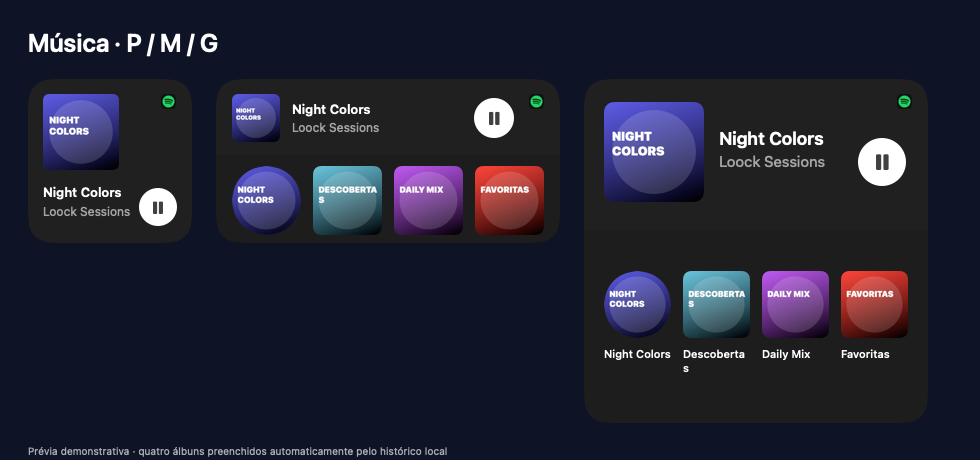

# Loock Mesa


Widgets para a Mesa do macOS Ventura 13.x, desenvolvido em SwiftUI e AppKit para Mac Intel.



## Download

[Baixar Loock Mesa 0.19.0 para Mac Intel](https://github.com/EDUVlNI/LoockMesa/releases/download/v0.19.0/LoockMesa-0.19.0-Intel.zip)

Requer macOS Ventura 13 ou posterior. Descompacte o ZIP, mova **LoockMesa.app** para **Aplicativos** e abra. Esta versão tem assinatura local (ad hoc), sem notarização Apple; o macOS pode bloquear a primeira abertura. No Ventura, use **Ajustes do Sistema → Privacidade e Segurança → Abrir Mesmo Assim**, se disponível e se confiar no download. Não é necessário desativar as proteções do sistema.

## Widgets

- Baterias do Mac e acessórios Bluetooth com leituras disponíveis no sistema.
- Clima com dados Open-Meteo e cores por horário e condição meteorológica.
- Relógio, calendário, lembretes e notas.
- Música para Apple Music, Spotify e Deezer pelo Reproduzindo Agora do macOS.

Tamanhos P/M/G, encaixe na grade, deslocamento entre widgets, modo de edição, preferências locais e fosco com intensidade individual. Há opção de abrir ao iniciar sessão.

## Abrir no Xcode

1. Abra `LoockMesa.xcodeproj`.
2. Selecione o esquema **LoockMesa** e o destino **My Mac**.
3. Compile e execute. O alvo requer macOS 13 e está configurado para Intel (`x86_64`).

O projeto foi compilado com Xcode 15.2. Para distribuir builds, ajuste a assinatura à sua conta. A versão de desenvolvimento usa assinatura local e não é notarizada.

## Música

Ative Música na galeria e reproduza uma faixa no aplicativo escolhido. O modo Automático acompanha o player ativo; a seleção explícita filtra o aplicativo. O flip da capa foi adaptado do player do projeto Eko.

O Spotify pode preencher automaticamente a fileira inferior com os últimos quatro álbuns identificados enquanto o widget está ativo. Esse histórico fica no Mac e começa vazio: não importa o histórico da conta e não exige login adicional. Clicar na capa abre uma busca pelo álbum no Spotify. Também há quatro atalhos manuais configuráveis por nome, link e imagem.

A integração de música usa **MediaRemote, um framework privado**, carregado dinamicamente. É experimental no Ventura e depende dos dados disponibilizados pelos players. Não há garantia de funcionamento em outras versões do macOS. Quando não há dados, o widget exibe um estado de espera.

## Permissões e limitações

- Calendário e Lembretes usam EventKit após autorização.
- A leitura opcional de Notas usa Automação; a nota local funciona independentemente.
- A bateria de acessórios depende das informações fornecidas ao macOS. O protocolo proprietário Huawei não está implementado.
- O clima é fornecido por Open-Meteo, não pelo aplicativo Tempo da Apple.
- O aviso de desbloqueio é observado por compatibilidade, sem garantia de entrega em todas as situações. O app não altera autenticação, loginwindow, SIP ou FileVault.
- A composição do fosco depende do wallpaper, do macOS e de Reduzir Transparência. Reduzir Movimento é respeitado.

## Testes

```sh
bash Tests/run.sh
bash Tests/run-ui-checks.sh
```

Os testes cobrem persistência, migração, grade, baterias, filtragem de players, controles de música e callbacks atrasados. Os testes de player usam fontes simuladas e não comprovam reprodução real nos três aplicativos. Testes que dependem de tela informam quando não podem executar sem sessão gráfica.

## Créditos

Interface inspirada nas referências de widgets fornecidas durante o desenvolvimento. SF Symbols e ícones dos aplicativos instalados são utilizados em tempo de execução. Clima: [Open-Meteo](https://open-meteo.com/).

Projeto independente, sem afiliação com Apple, Spotify ou Deezer. A prévia utiliza capas e faixas demonstrativas.
